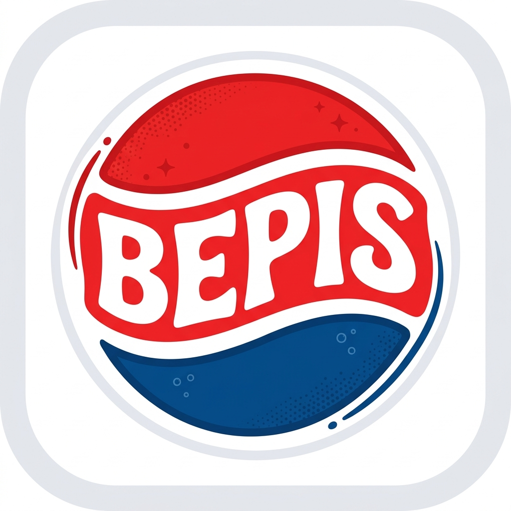

# 🥤 BepisLoader



**BepisLoader** is a native macOS power-tool for installing and managing **BepInEx** mods in Windows Unity games. It is specifically designed to handle the complexities of macOS compatibility layers like **CrossOver**, **CrossOver Preview**, **Whisky**, **GameHub**, **Wineskin**, and **Porting Kit**.

---

## 🚀 Key Features

| Feature | Details |
|---|---|
| **Universal Bottle Scanning** | Automatically detects bottles in CrossOver (including Preview builds), Whisky, GameHub, Wineskin, Porting Kit, and `~/.wine`. |
| **External SSD Support** | Reads GameHub's `game_container_store.json` and resolves `dosdevices/` symlinks to find games installed anywhere, including external APFS/ExFAT drives. |
| **Mono & IL2CPP Support** | Auto-detects the Unity backend and downloads the correct BepInEx build — stable 5.x for Mono, bleeding-edge 6.x for IL2CPP. |
| **Per-Layer Config Patching** | Patches `cxbottle.conf` (CrossOver), `bottle.plist` (Whisky), `system.reg` + `user.reg` (GameHub), `wine.cfg` (Porting Kit), and `Info.plist` (Wineskin) so mods load automatically when you hit Play — no manual env var fiddling. |
| **Auto-Quarantine Removal** | Automatically runs `xattr -rs com.apple.quarantine` on all BepInEx files to prevent macOS "Developer cannot be verified" errors. |
| **Mod Manager** | Install `.dll` plugins by file picker; enable/disable per-game; reads `[BepInPlugin]` metadata for display. |
| **Persistence** | Remembers your games, engine selections (Mono/IL2CPP), and bottle assignments across launches. |
| **Process Watcher** | Detects running Wine game processes even when launched externally through CrossOver, Whisky, or GameHub. |

---

## 🛠 Installation & Usage

1. **Download**: Grab the latest `BepisLoader.app` from the Releases page.
2. **Select Game**: The app will scan your bottles automatically. If your game is on an external drive, use the **"+ Add Game → From Mac / External Drive"** option.
3. **Install**: Click **"Install BepisLoader"**. It will download the correct BepInEx version, configure your Wine registry, and patch your compatibility layer's config files.
4. **Add Mods**: Use **"+ Add Mod…"** to install `.dll` plugin files into the game's `BepInEx/plugins/` folder.
5. **Launch**:
   - **IMPORTANT**: Launch the game **directly through your compatibility layer** (CrossOver, Whisky, GameHub, etc.) — not through BepisLoader itself. BepisLoader configures everything in advance so it just works when you hit Play.
   - Look for the BepInEx console window to pop up on launch — that's your confirmation it's working.

---

## ⚠️ macOS Permissions

BepisLoader will prompt for access to locations that might seem unexpected. **This is normal** — here's why each one is needed:

| Permission | Why it's needed |
|---|---|
| **Documents folder** | Some compatibility layers (Wineskin, Porting Kit) store bottle data inside `~/Documents` |
| **Downloads folder** | BepInEx archives are cached here after downloading to avoid re-downloading |
| **External volumes / removable media** | Required to scan and install mods into games on external SSDs (e.g. `/Volumes/MySSD/Games`) |
| **Photos library** | This prompt can appear as a side-effect of macOS's broad file access permission model — BepisLoader does not access your photos |

If you accidentally deny a permission, go to **System Settings → Privacy & Security** and re-enable the relevant category for BepisLoader.

---

## 🏗 Building from Source

```bash
# Clone the project
git clone https://github.com/yourusername/BepisLoader
cd BepisLoader

# Build the .app bundle using the included script
chmod +x build_app.sh inject_icon.sh
./build_app.sh

# (Optional) Inject the Bepis icon into the bundle
./inject_icon.sh BepisLogo.png
```

The resulting `BepisLoader.app` will be in `.build/release/`.
> [!TIP]
> You can drag this `.app` into your `/Applications` folder for permanent use.

---

## 📋 Technical Details

- **Language**: Swift 5.9 (Native macOS)
- **Minimum OS**: macOS 13.0 Ventura
- **Compatibility**: Supports both Intel and Apple Silicon (via Rosetta 2 for the games themselves).
- **Injection Method**: Uses `winhttp.dll` + `version.dll` proxying via `WINEDLLOVERRIDES`, configured automatically per compatibility layer.
- **BepInEx**: Stable 5.4.23.2 (Mono) or Bleeding Edge 6.x (IL2CPP), selected automatically based on detected Unity backend.

### How injection works

BepisLoader uses [Unity Doorstop](https://github.com/NeighTools/UnityDoorstop) to inject BepInEx into the Unity runtime before any game code runs. Doorstop proxies `winhttp.dll` and reads `doorstop_config.ini` to load the BepInEx preloader.

```
Game.exe
  └── Wine loads winhttp.dll (Doorstop proxy)
        └── Doorstop reads doorstop_config.ini
              └── Loads BepInEx.Preloader.dll
                    └── BepInEx loads plugins from BepInEx/plugins/
```

For this to work, `WINEDLLOVERRIDES=winhttp,version=n,b` must be set in the Wine process environment. BepisLoader patches this into every supported compatibility layer's own config format so it's always active when you launch from there.

### Per-layer patching

| Layer | What gets patched |
|---|---|
| CrossOver / CrossOver Preview | `cxbottle.conf` → `[EnvironmentVariables]` |
| Whisky | `bottle.plist` → `environmentVariables` dict + `launch_bepis.sh` wrapper |
| GameHub | `system.reg` + `user.reg` inside the virtual container |
| Porting Kit | `wine.cfg` → `[DllOverrides]` for every installed engine + `user.reg` |
| Wineskin | `Info.plist` → `LSEnvironment` dict, re-registered with Launch Services |
| Standalone Wine | `user.reg` → `[Software\\Wine\\DllOverrides]` |

### Bottle detection paths

| Layer | How bottles are found |
|---|---|
| CrossOver | `~/Library/Application Support/CrossOver/Bottles/<name>` |
| CrossOver Preview | `~/Library/Application Support/CrossOver-Preview/Bottles/<name>` |
| Whisky | `~/Library/Containers/com.isaacmarovitz.Whisky/Bottles/<name>` |
| GameHub | `game_container_store.json` → `wine-engine/containers/virtual_containers/<id>` |
| Wineskin | `~/Applications/Wineskin/<name>.app/Contents/SharedSupport/prefix` |
| Porting Kit | `~/Library/Application Support/PortingKit/<name>` |
| Standalone Wine | `~/.wine` or `$WINEPREFIX` |

---

## 🔧 Troubleshooting

| Symptom | Fix |
|---|---|
| No bottles detected | Hit **↺ Scan** — bottles created after the app opened won't appear automatically |
| Game on external SSD not found | Use **"+ Add Game → From Mac / External Drive"** to browse to the `.exe` directly |
| BepInEx console doesn't appear | Confirm `winhttp.dll` exists in the game directory; check that your layer's config was patched (re-run Install if unsure) |
| Mods not loading | Confirm DLLs are in `BepInEx/plugins/`, not a subdirectory; check `BepInEx/LogOutput.log` via the **View Log** button |
| IL2CPP game crashes | Make sure **Engine** is set to IL2CPP in the detail pane — use the **Toggle Engine** button and reinstall |
| macOS "unverified developer" on DLLs | Reinstall — BepisLoader strips quarantine automatically |
| CrossOver Steam games ignore overrides | CrossOver's Steam container sandboxes its own environment; try launching the `.exe` directly from CrossOver rather than through the Steam overlay |
| BepisLoader asks for Photos / Documents access | This is expected — see the [Permissions](#️-macos-permissions) section above |

---

## 📁 File Structure

```
BepisLoader/
├── Package.swift
├── README.md
├── BepisLogo.png
├── build_app.sh
├── inject_icon.sh
└── Sources/BepisLoader/
    ├── main.swift                     # Entry point
    ├── AppDelegate.swift              # Window setup
    ├── Models.swift                   # Bottle, GameInstall, Mod types
    ├── BottleScanner.swift            # Detects bottles, resolves dosdevices, finds Unity games
    ├── BepInExInstaller.swift         # Downloads, extracts, and patches all layer configs
    ├── ModManager.swift               # Install / remove / toggle mods
    ├── PersistenceManager.swift       # Saves game list across launches
    ├── ProcessWatcher.swift           # Monitors running Wine processes
    ├── GameLauncher.swift             # Path translation and Wine env helpers
    ├── MainViewController.swift       # 3-pane split view UI
    └── GameDetailViewController.swift # Install / mod / log panel
```

---

## 🤝 Credits

Created by **Kiwi Singh** and the community. Special thanks to the BepInEx team for the legendary modding framework.

*Disclaimer: BepisLoader is not affiliated with PepsiCo, BepInEx, CodeWeavers, or GameSir. Stay hydrated.*
