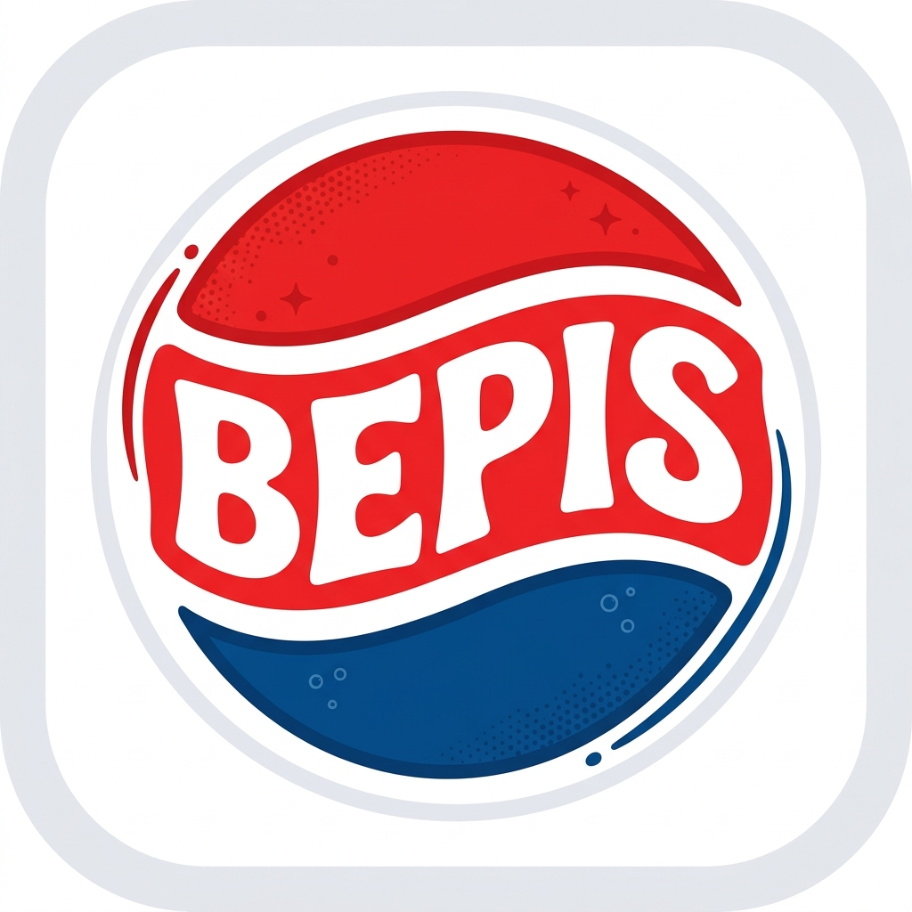

# 🥤 BepisLoader



**BepisLoader 2.1** is a native macOS mod-management application with a framework-agnostic architecture supporting BepInEx workflows and expanding toward Reloaded-II. It installs and manages mods for Windows games running through compatibility layers and integrates with Steamac for SteamOS VM workflows. It is specifically designed to handle the complexities of macOS compatibility layers like **CrossOver**, **CrossOver Preview**, **Whisky**, **GameHub**, **Wineskin**, and **Porting Kit**.

[Download BepisLoader 2.1.0](https://github.com/KiwiSingh/BepisLoader/releases/tag/v2.1.0) · [All releases](https://github.com/KiwiSingh/BepisLoader/releases)

---

## 🚀 Key Features

| Feature | Details |
|---|---|
| **Universal Bottle Scanning** | Automatically detects bottles in CrossOver (including Preview builds), Whisky, GameHub, Wineskin, Porting Kit, and `~/.wine`. |
| **External SSD Support** | Reads GameHub's `game_container_store.json` and resolves `dosdevices/` symlinks to find games installed anywhere, including external APFS/ExFAT drives. |
| **Mono & IL2CPP Support** | Auto-detects the Unity backend and downloads the correct BepInEx build — stable 5.x for Mono, bleeding-edge 6.x for IL2CPP. |
| **Per-Layer Config Patching** | Patches `cxbottle.conf` (CrossOver), `bottle.plist` (Whisky), `game-settings/<hash>.json` + Wine registry (GameHub), `wine.cfg` (Porting Kit), and `Info.plist` (Wineskin) so mods load automatically when you hit Play. |
| **Direct Env Injection** | For GameHub, BepisLoader injects `DOORSTOP_ENABLE`, `DOORSTOP_INVOKE_DLL_PATH`, and mandatory Mono runtime paths directly into the `environment` dictionary in GameHub's settings JSON for maximum reliability. |
| **Auto-Quarantine Removal** | Automatically runs `xattr -rs com.apple.quarantine` on all BepInEx files to prevent macOS "Developer cannot be verified" errors. |
| **Mod Manager** | Install `.dll` plugins by file picker; handles macOS security scoping for external drives; reads `[BepInPlugin]` metadata for display. |
| **Steamac Integration** | Discover SteamOS games, inspect Proton and Windows architecture, deploy BepInEx, and review framework installation and recovery evidence through the guest bridge. |
| **Asset Mods** | Game-agnostic **Install asset mod…** / **Disable asset mods** controls select a supported adapter. The first adapter replaces Digimon Story Time Stranger DDS textures while its x64 game runs under ARM64 Proton. |
| **Checked Publication** | Asset packages reject executable mod payloads, unsupported dependencies, symlinks, conflicting paths and oversized files. The guest verifies the pinned game build and loader before publishing without replacing existing files. |
| **Multi-Framework Architecture** | Framework-neutral game and mod management with Reloaded-II installation and dependency-management infrastructure. |

---

## 🐸 What's new in v2.1.0

- **Verified ARM64 SteamOS texture replacement:** the FMC Eyes Green mod rendered green eyes in the x64 Digimon Story Time Stranger game under Proton 11.0 ARM64. The native loader logged replacement of the exact eye texture; the result was confirmed visually in gameplay.
- **Game-agnostic asset installation:** choose an extracted mod folder in the Steamac cockpit. BepisLoader selects the adapter, snapshots validated assets, uploads through `bepis.sock`, and requests guest-enforced publication. Steam can remain open; the game must be closed.
- **Independent native MVGL adapter:** no Reloaded-II or .NET hosting is needed for supported asset mods. The game payload stays Windows x64; the coordinating Linux tools support ARM64 and x64 separately.
- **Steamac safety and recovery work:** payload hashing, release/provenance discovery, bounded guest recovery inventories, recovery-scope planning, host recovery rehearsals, and transactional installer checks remain in place. Static inventory and host rehearsals are not presented as live recovery or injection proof.
- **Release packaging:** universal Intel/Apple Silicon macOS application, bundled adapter licenses and source references, and the app icon injected automatically by `inject_icon.sh`.

### Asset-mod setup and limits

1. Use a Steamac build advertising `assetModInstallV1` ([companion source patch](https://github.com/KiwiSingh/steamac/pull/2)). Older bridges reject installation safely; copying the macOS app alone does not update the guest agent.
2. Close the game, leave Steam open, select it in BepisLoader's Steamac cockpit, and choose **Install asset mod…**. Select the extracted folder containing `ModConfig.json` and `dsts-loader/`.
3. **Manual launch setting required:** copy the exact setting from BepisLoader's installation report into Steam → game Properties → Launch Options. It includes the installed asset path, executable hash, and `WINEDLLOVERRIDES='winmm=n,b'`. Preserve any existing options; conflicting Wine overrides need reconciliation. BepisLoader does not change Steam's settings automatically.
4. Start the game with Steam's **Play** button. **Disable asset mods** parks the checked native adapter; assets are retained. Remove the BepisLoader launch setting when it is no longer needed.

The first adapter supports one selected DDS texture package per launch for **Digimon Story Time Stranger**, AppID `1984270`, with executable SHA-256 `ff9de825a543bf874cfb7e73ed951256d3ce4e8702957afa3b26ca6487a81688`. It resolves the game's `.img` requests to mod `.dds` files. Other builds and games require their own verified adapter; unsupported ones stay blocked. Assets are snapshotted at launch, so edits require restarting the game. The generic controls do not claim universal game compatibility.

Full Reloaded-II / managed-plugin initialization under ARM64 Proton remains unresolved. This release validates the independent texture-replacement path, not every mod loader or mod type. Existing generic launch-reservation and installation safety gates remain fail closed.

## 🛠 Installation & Usage

1. **Download**: Download and extract [BepisLoader-v2.1.0-macOS-universal.zip](https://github.com/KiwiSingh/BepisLoader/releases/download/v2.1.0/BepisLoader-v2.1.0-macOS-universal.zip).
2. **Select Game**: The app will scan your bottles automatically. If your game is on an external drive, use the **"+ Add Game → From Mac / External Drive"** option.
3. **Install**: Click **"Install BepisLoader"**. It will download the correct BepInEx version, configure your Wine registry, and patch your compatibility layer's config files.
4. **Add Mods**: Use **"+ Add Mod…"** to install `.dll` plugin files into the game's `BepInEx/plugins/` folder.
5. **Launch**:
   - **IMPORTANT**: Launch the game **directly through your compatibility layer** (CrossOver, Whisky, GameHub, etc.)
   - **IL2CPP Games**: On the very first launch, you may see a black screen for 10-30 seconds. **Do not close the game.** BepInEx is generating interop assemblies (check `BepInEx/LogOutput.log` to see progress). Subsequent launches will be instant.

---

## 🏗 Building from Source

```bash
# Clone the project
git clone https://github.com/KiwiSingh/BepisLoader
cd BepisLoader

# Build the .app bundle using the included script
chmod +x build_app.sh inject_icon.sh
./build_app.sh

# build_app.sh also runs inject_icon.sh automatically.
# To reinject the icon into an existing bundle:
./inject_icon.sh BepisLogo.png
```

The resulting `BepisLoader.app` will be in `.build/release/`.

---

## 📋 Technical Details

- **Language**: Swift 5.9 (Native macOS)
- **Minimum OS**: macOS 13.0 Ventura (macOS 26 Tahoe for GameHub users)
- **Compatibility**: Supports both Intel and Apple Silicon (via Rosetta 2 for the games themselves).
- **Injection Method**: Uses `winhttp.dll` + `version.dll` proxying via `WINEDLLOVERRIDES`.
- **GameHub Injection**: Patches `game-settings/<hash>.json` at `settings.environment`. Uses absolute `Z:\` paths for all Doorstop variables to support games on external volumes.
- **Security Scoping**: BepisLoader uses `startAccessingSecurityScopedResource` when copying mods from external drives to bypass macOS read/write restrictions.

---

## 📝 Changelog

### v2.1.0
- Added checked asset-only mod installation and disabling through the Steamac bridge.
- Confirmed Digimon Story Time Stranger eye-texture replacement in ARM64 SteamOS / x64 Proton gameplay.
- Included current Steamac recovery, provenance and installer work without weakening runtime safety gates.
- Documented the required manual Steam launch setting and matching guest capability.
- Bundled the app icon, adapter licenses, and corresponding source references.

### v2.0.0
- Added Steamac integration and a framework-neutral mod-management architecture.
- Added Reloaded-II integration infrastructure; broader compatibility testing is ongoing.
- Validated BepInEx mods in Steamac with Digimon World: Next Order.

### v1.0.2
- **Fixed GameHub mod injection.** BepInEx mods now load correctly in GameHub games via authoritative `settings.environment` patching.
- **Fixed Mod Installation (Security Scoping)**: Resolved a macOS permission issue where mod DLLs selected via the GUI were being blocked from copying to external drives.
- **IL2CPP Runtime Support**: Added automatic injection of `DOORSTOP_MONO_RUNTIME_LIB` and `DOORSTOP_MONO_CONFIG_DIR`.
- **Fixed Wine registry corruption** by using `wine reg add` via the layer's own Wine binary.
- **External SSD Discovery**: Fully supported via `game_container_store.json` and `dosdevices` resolving.
- **UI Refinement**: Improved the mod list refresh logic.

### v1.0.1
- Added per-layer config patching for Whisky, GameHub, Porting Kit, and Wineskin.
- GameHub bottle names now resolved from `game_container_store.json`.

### v1.0.0
- Initial release.

---

## 🤝 Credits

Created by **Kiwi Singh** and the community. Special thanks to the BepInEx team for the legendary modding framework.

------------------------------------------------------------------------

## ☕ Support the Project

[](https://ko-fi.com/kiwisingh)

------------------------------------------------------------------------

*Disclaimer: BepisLoader is not affiliated with PepsiCo, BepInEx, CodeWeavers, or GameSir. Stay hydrated.*
